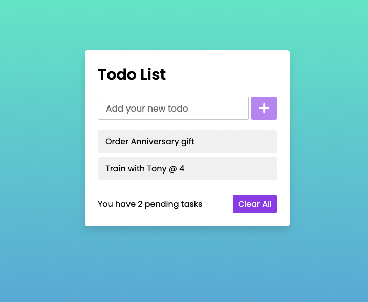

# todo-list

[](https://github.com/siryaw/todo-list)



## Description

Todo lists are a list of tasks you may need to complete within a given time. In this app, the content box holds the input field. Click the plus button to enter a task. You can also delete each item by clicking on the trash icon when hovering over the item. The pending items list is updated as you add and delete tasks.

## Table of Contents

- [Demo](#Demo)
- [License](#license)
- [Questions](#questions)

## Demo

[Demo Here](https://coherent-locket33.surge.sh/)

```

```

## License

This project is licensed under the MIT license.

## Questions


If you have any questions about the repo, open an issue or contact [siryaw](https://api.github.com/users/siryaw) directly at null.
